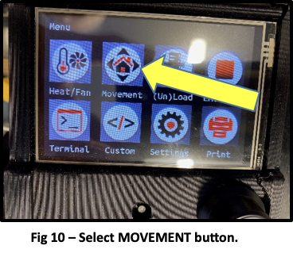

# CNC Router Instructions & Accreditation

The CNC router installed at Men in Sheds MK is a 2-1/2 axes CNC unit for the production of parts made from soft materials.  This may include some plastics and most species of wood.  This machine is not designed to cut brass, aluminium or steel.

The unit consists of a wooden stand and a framework for supporting and guiding the cutting operation.  The drive system can move a variety of small carbide wood cutting bits in the X, Y and Z axes with shank sizes up to 6.35mm (1/4-inch).  A program, consisting of basic G codes, is required to move the cutter along these three axes.

The following G codes are accepted by the control unit:

- G92    Set part zero (starting point)
- G00    Move quickly to a new location
- G01    Move in a straight line at the programmed cutting feed
- G02    Move in a clockwise arc at the programmed cutting feed
- G03   Move in a counter clockwise arc at the programmed cutting feed

An F code is used to set the feed rate.  This value determines how fast the cutter will travel (feed) through the workpiece.  It is normally expressed in mm/min (millimeters per minute).

**Additional ‘M’ codes (Miscellaneous functions) may also be included in the program.**  For example: M106 PO will switch the spindle and the dust extraction system on;  M107 PO will switch them off.

**Please ask a person familiar with G code programming to review your program before loading and running it on the machine.**

The machine is relatively simple to use but can pose a danger to those who are not familiar with its operation.

HEARING AND EYE PROTECTION ARE REQUIRED TO OPERATE OR OBSERVE THIS EQUIPMENT WHEN RUNNING.

DUST EXTRACTION WILL BE REQUIRED WHEN MACHINING WOOD AND PLASTICS.

A FULLY FITTED FACE MASK (FFP1 or better) IS ALSO REQUIRED WHEN MACHINING MDF AND OTHER WOOD PRODUCTS.

## Machine Preparation

1. Check to make sure that the machine is switched off by pressing the red power button.  See Fig. 1
 
2. Copy the G code file to a USB stick. Install this stick in the controller interface on the control box on top of the machine gantry.  See Fig. 2.  Do not turn the machine on.

3. Clean the machine surfaces using a dry rag, brush and the vacuum cleaner.  Pay particular attention to surfaces where the roller guides move along the X and Y axes.  Remove any tools or scrap material from the work table.
4. Select the cutting tool with the diameter specified in your program.  This machine uses mostly solid carbide cutters that must be sharp and in good condition.  Select the collet size that matches the shank diameter of the cutter you are using.

## Installing or Changing the Cutter

1. Turn the machine off and isolate it by pressing the emergency stop button on the front of the machine.
2. Press and hold the red spindle lock button on the router head.  See Fig 4.

3. Loosen the retaining nut that holds the cutter and collet until it comes completely off.  It has a right-hand thread.  See Fig. 5

4. Clean the collet and spindle nut.
5. Insert a new cutter with the corresponding size collet.  Ensur that the cutter shank is fully engaged with the collet so that it does not extend too far.  An incorrectly installed cutter may deflect and break.
6. Reinstall the retaining nut and tighten it.

# Homing the Machine

1. Disengage the emergency stop button by twisting it.
2. Turn the power on at the sockets on the wall.  See Fig. 6

3. Fig 6 – Switch on power.The main menu screen will be displayed on the control panel.  Press the MOVEMENT button.  See Fig. 7

4. Press the HOME button on the Control Panel to go to the HOME menu.  See Fig. 8

5. Press the HOME button on the home menu screen to zero each of the axes.  This is a necessary procedure each time the machine is switched on.  Each axes will move to its home position, starting with the Z.

# Locating the Workpiece and Setting the Cutter Start Position

1. Check that the router spindle is switched off.
2. Position and secure the work material to the machine table.
3. Select the MOVEMENT button from the Main menu screen.  See Fig. 10

4. Select the MOVE button.  See Fig. 11

5. Carefully select the amount you would like each axes to move each time you press the X, Y or Z axes buttons.  Smaller increments are safer to use.  See Fig 12.  Then move each of the axes using the buttons in the MOVE menu. Once an axes has been selected, you can also use the knob on the control panel to move each axis.

6. With the router spindle switched off, position each of the axes to align your cutter in relation to the starting position of your part material.  This position is referenced by the G92 command in your G-Code program.  You may use a piece of paper as you bring down the Z axis to help position the tool on or above the part surface.  You may also use the tool height setting.

# Machining the Part

1. Put on all required safety equipment.
2. Switch the machine on by releasing the emergency stop button and then powering on the sockets on the wall. 
3. Zero the machine axes.
4. Move the cutter to the start position, using the X, Y and Z buttons in the MOVE menu.
5. Select the PRINT button on the MAIN menu.  See Fig 13.

6. Select the USB option from the PRINT menu.  See Fig 14.

7. Select the file containing the G-Code.

8. Select the spindle speed using the dial on the top of the spindle head.  See Fig 15.

9. Switch on the dust vacuum extraction system if you have not used M106 P0 in your G-Code program.
10. Turn the router spindle on if you have not used M106 P0 in your G-Code program.  See Fig 16.

11. Select the OK button on the PRINT menu.  The machine will now start cutting.  See Fig 17.

12. Make adjustments to the federate if necessary using the XXXX button on the XXXXXX menu.
13. Turn the spindle off and isolate the machine power supply with the emergency off button when the machining operation is completed.

DO NOT LEAVE THE MACHINE UNATTENDED WHILE IT IS IN OPERATION.

DO NOT HAVE YOUR HANDS ANYWHERE NEAR THE CUTTING AREA WHILE THE MACHINE IS RUNNING.

MAINTAIN EASY ACCESS TO THE EMERGENCY STOP BUTTON IN CASE SOMETHING GOES WRONG.  PRESSING THIS BUTTON WILL STOP AND ISOLATE THE MACHINE COMPLETELY.

IT IS YOUR RESPONSIBILITY TO CLEAN THE MACHINE AND SURROUNDING WORK AREA AFTER YOU HAVE USED IT.

**Please report any damage, breakages or problems with the CNC router to ensure that the machine is always kept in good working order.**

# Further Reading:

- [Lowrider v3 Docs](https://docs.v1e.com/lowrider/)
- - [Milling Basics](https://docs.v1e.com/tools/milling-basics/) This section is a MUST read.
